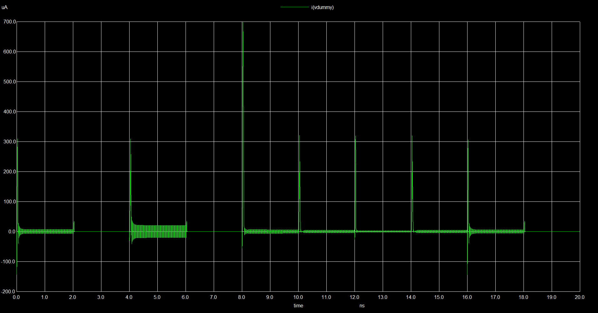

# Sistemas-Digitais
Esse repositório contém materiais e exercícios referentes à matéria de Sistemas Digitais (COMP0514). Sendo a parte prática ministrada pelo professor Caleb Micael, PhD em conjunto com a parte teórica com o professor Rodolfo Botto, Phd.

---

<details>
<summary><h2>Laboratório 05: Simulação de Circuitos Digitais com SPICE</h2></summary>

Este repositório contém os arquivos de simulação e validação desenvolvidos para o estudo de circuitos combinacionais e portas lógicas utilizando o simulador elétrico **Ngspice**. O foco principal deste laboratório foi a construção e análise do comportamento dinâmico e de consumo de um **Multiplexador 2:1**.

## • Estrutura do Projeto

```text
├── lab05/
│   ├── hspice/              # Modelos e includes adicionais (ignorado no git)
│   ├── spice/
│   │   └── NangateOpenCellLibrary.spi # Biblioteca de células padrão (ignorado no git)
│   ├── inversor.sp          # Netlist de simulação do inversor
│   ├── invs_nangat.sp       # Netlist auxiliar
│   ├── mux.sp               # Netlist principal do Multiplexador 2:1
│   ├── ptm_45nm.bsim4.lib   # Modelo preditivo de transistores 45nm (ignorado no git)
│   └── README.md            # Documentação do projeto
```

---

## • Pré-requisitos e Dependências

Para executar as simulações deste repositório, é necessário ter o **Ngspice** instalado no sistema e obter os modelos físicos e lógicos de terceiros (que não são versionados neste repositório por boas práticas de gerenciamento de código).

### 1. Download das Bibliotecas

As seguintes dependências externas devem ser baixadas e posicionadas nos respectivos locais indicados na estrutura de pastas:

* **Modelos Preditivos de 45nm (PTM):**
    * Obtenha o arquivo de tecnologia BSIM4 (`ptm_45nm.bsim4.lib`) diretamente do site oficial do *Predictive Technology Model (PTM)* de Arizona State University (ASU).
    * O arquivo deve ser salvo diretamente na raiz da pasta `lab05/`.

* **Nangate Open Cell Library:**
    * Baixe a biblioteca de células padrão de 45nm da Nangate (`NangateOpenCellLibrary.spi` ou equivalente).
    * Crie uma pasta chamada `spice/` dentro de `lab05/` e insira o arquivo `.spi` nela.

### 2. Configuração de Caminhos no Código

O arquivo `mux.sp` utiliza caminhos relativos para importar os modelos lógicos e físicos. Certifique-se de que as linhas de importação no início do seu arquivo `.sp` correspondam à estrutura de pastas configurada:

```spice
.lib ptm_45nm.bsim4.lib TT
.include "spice/NangateOpenCellLibrary.spi"
```

---

## • Como Executar a Simulação

Com o Ngspice instalado e configurado nas variáveis de ambiente do seu sistema operacional, abra o terminal na raiz da pasta `lab05/` e execute o comando:

```bash
ngspice mux.sp
```

O bloco `.control` configurado no arquivo executará automaticamente a análise transiente (`tran`) e abrirá as janelas gráficas correspondentes para a análise visual.

---

## • Análise de Resultados

Abaixo estão os resultados obtidos a partir da simulação transiente do Multiplexador 2:1, mapeando o comportamento temporal das entradas `IN1`, `IN2` e do seletor `SEL` em relação à saída `OUT`.

### 1. Diagrama de Tempos (Sinais Lógicos)


* **Análise Lógica:** O gráfico acima comprova a integridade funcional do multiplexador projetado. 
    * No intervalo de **0ns a 8ns**, a linha de seleção `v(sel)` permanece em nível baixo (0). Observa-se que a saída `v(out)` replica fielmente o comportamento oscilatório da entrada `v(in1)`.
    * No intervalo de **8ns a 16ns**, quando `v(sel)` transiciona para o nível alto (1), o circuito passa a ignorar as variações de `v(in1)` e sua saída passa a rastrear perfeitamente a entrada `v(in2)`.
    * Após **16ns**, o seletor retorna a 0 e o comportamento inicial de rastreamento da `IN1` é reestabelecido instantaneamente, validando a tabela verdade do componente no tempo.

### 2. Perfil de Corrente e Consumo Dinâmico



* **Análise Elétrica:** A medição da corrente extraída do nó de alimentação por meio da fonte dummy (`Vdummy`) ilustra a característica nativa da tecnologia **CMOS 45nm**. 
    * Nos estados em que as tensões das entradas estão estáveis, a corrente consumida é praticamente nula (corrente estática originada apenas por correntes de fuga/leakage).
    * Nos momentos exatos de transição de estado dos sinais (borda de subida ou descida), ocorrem picos acentuados de corrente dinamicamente (atingindo ordens de centenas de microamperes). Isso ocorre devido ao chaveamento simultâneo dos transistores internos (corrente de curto-circuito momentânea) e à necessidade de carga e descarga das capacitâncias parasitas dos nós do circuito.

</details>