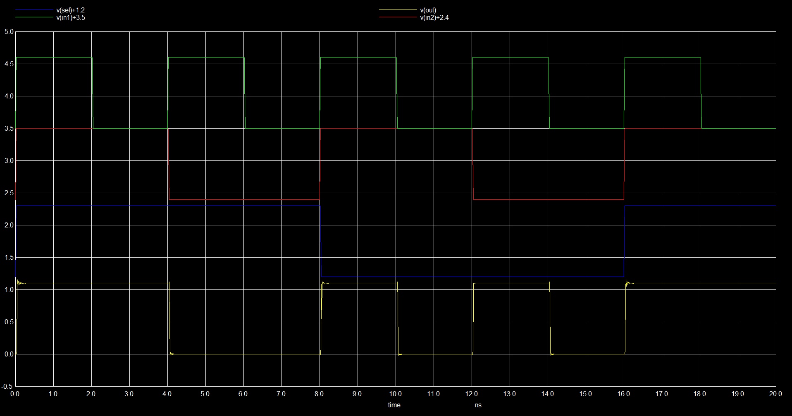
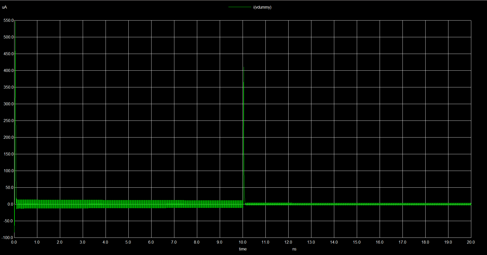
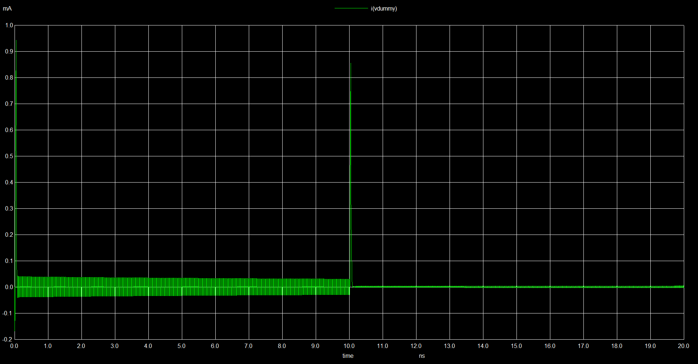

# Sistemas-Digitais
Esse repositório contém materiais e exercícios referentes à matéria de Sistemas Digitais (COMP0514). Sendo a parte prática ministrada pelo professor Calebe Micael, PhD em conjunto com o professor Rodolfo Botto, Phd, responsável pela parte teórica.

---

<details>
<summary><h2>Laboratório 05: Simulação de Circuitos Digitais com SPICE</h2></summary>

Este repositório contém os arquivos de simulação e validação desenvolvidos para o estudo de circuitos combinacionais e portas lógicas utilizando o simulador elétrico **Ngspice**. O foco principal deste laboratório foi a construção e análise do comportamento dinâmico e de consumo de um **Multiplexador 2:1**, avaliando diferentes padronizações de entrada, frequências de operação e dimensionamento de células padrão.

## • Estrutura do Projeto

```text
├── lab05/
│   ├── hspice/              # Modelos e includes adicionais (ignorado no git)
│   ├── spice/
│   │   └── NangateOpenCellLibrary.spi # Biblioteca de células padrão (ignorado no git)
│   ├── inversor.sp          # Netlist de simulação do inversor
│   ├── invs_nangat.sp       # Netlist auxiliar
│   ├── mux_x1.sp            # Netlist do MUX 2:1 com células de dimensão 1X
│   ├── mux_x2.sp            # Netlist do MUX 2:1 com células de dimensão 2X
│   ├── ptm_45nm.bsim4.lib   # Modelo preditivo de transistores 45nm (ignorado no git)
│   └── README.md            # Documentação do projeto
```

---

## • Pré-requisitos e Dependências

Para executar as simulações deste repositório, é necessário ter o **Ngspice** instalado no sistema e obter os modelos físicos e lógicos de terceiros (que não são versionados neste repositório por boas práticas de gerenciamento de código).

### 1. Download das Bibliotecas

As seguintes dependências externas devem ser baixadas e posicionadas nos respectivos locais indicados na estrutura de pastas:

* **Modelos Preditivos de 45nm (PTM):**
    * Obtenha o arquivo de tecnologia BSIM4 (`ptm_45nm.bsim4.lib`) diretamente do site oficial do *Predictive Technology Model (PTM)* de Arizona State University (ASU).
    * O arquivo deve ser salvo diretamente na raiz da pasta `lab05/`.

* **Nangate Open Cell Library:**
    * Baixe a biblioteca de células padrão de 45nm da Nangate (`NangateOpenCellLibrary.spi` ou equivalente).
    * Crie uma pasta chamada `spice/` dentro de `lab05/` e insira o arquivo `.spi` nela.

### 2. Configuração de Caminhos no Código

Os arquivos de netlist utilizam caminhos relativos para importar os modelos lógicos e físicos. Certifique-se de que as linhas de importação no início dos seus arquivos `.sp` correspondam à estrutura de pastas configurada:

```spice
.lib ptm_45nm.bsim4.lib TT
.include "spice/NangateOpenCellLibrary.spi"
```

---

## • Como Executar a Simulação

Com o Ngspice instalado e configurado nas variáveis de ambiente do seu sistema operacional, abra o terminal na raiz da pasta `lab05/` e execute o comando correspondente ao circuito que deseja analisar:

```bash
ngspice mux_x1.sp
# ou
ngspice mux_x2.sp
```

O bloco `.control` configurado em cada arquivo executará automaticamente a análise transiente (`tran`), efetuará as medições de corrente (`meas`) e abrirá as janelas gráficas correspondentes.

---

## • Análise de Resultados

O circuito foi submetido a testes para validar sua tabela verdade e avaliar seu desempenho elétrico sob uma carga capacitiva de **10 fF** associada em série à saída (`OUT`).

### 1. Diagrama de Tempos e Validação Lógica (Dimensão 1X)

Para garantir o estímulo de todas as combinações de entrada, os sinais foram configurados com larguras de pulso e períodos dobrados sistematicamente.



* **Análise Funcional:** O gráfico comprova a integridade da lógica de roteamento do multiplexador. 
    * No intervalo de **0ns a 8ns**, a linha de seleção `v(sel)` permanece em nível baixo (0). Observa-se que a saída `v(out)` replica fielmente o comportamento oscilatório da entrada `v(in1)`.
    * No intervalo de **8ns a 16ns**, quando `v(sel)` transiciona para o nível alto (1), o circuito passa a ignorar as variações de `v(in1)` e sua saída passa a rastrear perfeitamente a entrada constante em nível alto de `v(in2)`.
    * Após **16ns**, o seletor retorna a 0 e o comportamento inicial de rastreamento da `IN1` é reestabelecido, validando a tabela verdade do componente.

### 2. Perfil de Corrente e Potência a 50 MHz (1X vs 2X)

Para esta análise, as entradas de dados foram fixadas (IN2=1, IN1=0) e o pino seletor (SEL) foi submetido a uma frequência de oscilação de **50 MHz** (período de 20ns). A potência média dissipada no intervalo foi calculada através da relação P = VDD × I_avg, onde a corrente média foi extraída via comando `.meas` no Ngspice.

#### Cenário A: Células Lógicas de Dimensão 1X (`mux_x1.sp`)



* **Análise Elétrica:** O gráfico ilustra o comportamento dinâmico típico da tecnologia CMOS 45nm. A corrente consumida em estado estacionário é praticamente nula. Nos momentos de transição do sinal `SEL` (chaveamento), ocorrem picos acentuados de corrente necessários para carregar e descarregar as capacitâncias parasitas internas e a carga de 10 fF na saída. 
* **Potência Dissipada:** A partir da corrente média aferida pelo simulador, a potência dissipada pelo circuito dimensionado em 1X se mantém em níveis mínimos projetados para essa biblioteca padrão. *(Insira o valor calculado aqui, ex: X.XX uW)*.

#### Cenário B: Células Lógicas de Dimensão 2X (`mux_x2.sp`)



* **Análise Elétrica Comparativa:** Ao substituir todas as portas lógicas por células de dimensão 2X, a largura dos transistores (drive strength) é dobrada. Consequentemente, observa-se que as amplitudes dos picos de corrente nos instantes de chaveamento são consideravelmente maiores em comparação ao circuito 1X.
* **Impacto na Potência:** Embora o circuito 2X possua maior capacidade de condução de corrente (o que acelera as transições de sinal), as capacitâncias de porta (gate capacitance) dos transistores também são maiores. Isso resulta em um aumento direto na corrente média consumida e, portanto, **a potência total dissipada pelo circuito é significativamente maior** do que na versão 1X. *(Insira o valor calculado aqui, ex: Y.YY uW)*.

</details>


<details>
<summary><h2>Laboratório 06:</h2></summary>
   Em andamento
</details>


<details>
<summary><h2>Laboratório 07:</h2></summary>
   Em andamento
</details>
